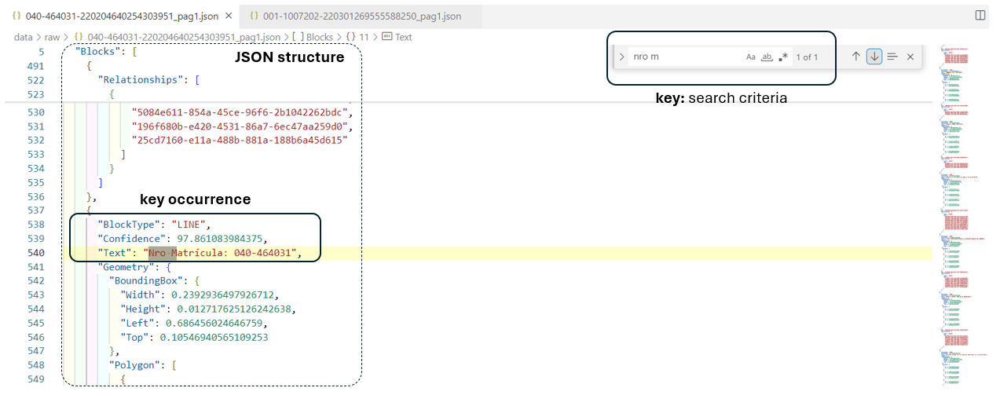
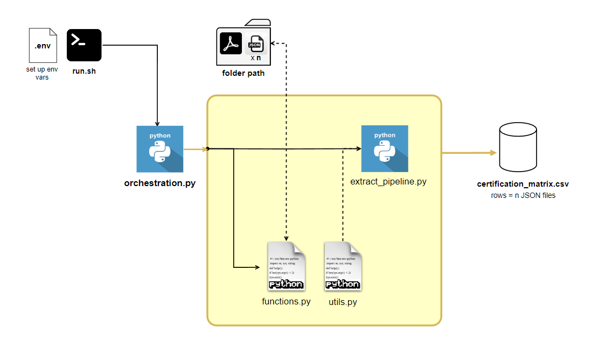
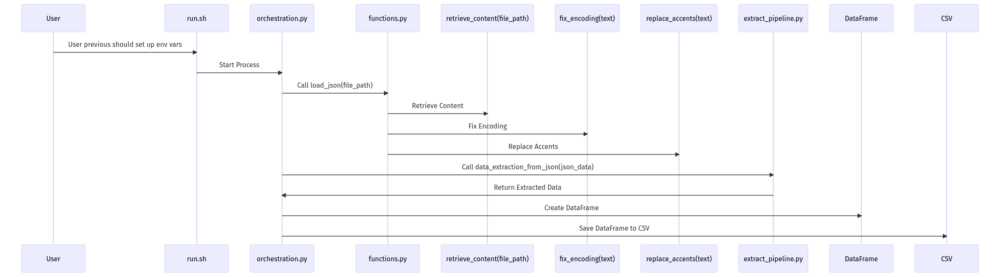

# Extracting Property Certificate Information from OCR JSON Outputs

## Index
1. [Introduction](#introduction)
2. [Solution strategy](#solution-strategy)
3. [Technical solution](#technical-solution)
4. [Project structure](#project-structure)
5. [Configuration](#configuration)


## Introduction
### Context
This project focuses on extracting key information from property certificates using JSON files generated by an Optical Character Recognition (OCR) process. 

OCR is a technology that converts printed text into digital data. AWS Textract, an Amazon service, performs OCR on PDF documents via its DetectDocumentText API. This API processes the PDFs and produces JSON files containing the extracted text and its coordinates in the document. The project uses these JSON files as input to extract specific information from the property certificates

### Project Goal 
The goal is to develop a Python script that extracts specific fields from JSON files produced by AWS Textract for property certificates. The JSON files contain OCR results from the first page of each certificate. The script should:

1. Accept the path to the JSON file as input
2. Extract he property registration number (Nro Matrícula), printing date (in YYYY-MM-DD format), department, municipality, locality (vereda), and folio status from the JSON data.
3. **Generalize**:Ensure the script can process any certificate with a similar structure and field arrangement.

## Solution Strategy

### Inductive Thinking

**Project requirements**  

* The **input** for the project is a **path** to a JSON file.
* The data we need to extract is **located on the first page** of the document. Due to proximity, it is possible that the search criteria will be found in the first occurrence within the JSON file.
* The JSON files used for the project **have the same structure and arrangement** of the required fields 

Given the project requirements, the approach involves simulating a human search using "Control + F" for keywords within the file. This strategy aims to identify and extract relevant data by locating specific keywords in the initial part of the JSON file.



To achieve this, it is necessary to analyze the JSON structure to locate the data. 

### JSON Structure

The provided JSON is structured into two  main parts:

* **DocumentMetadata**, which provides general information about the document
* **Blocks**, which contains a list of text blocks and other structures within the document. Each block has a **type** and may contain **text**, geometry, and relationships with other blocks.

Each block can have different types. Blocks of type **'LINE'** contain the text that needs to be extracted. Therefore, each BlockType is represented as a dictionary with key-value pairs, where **'Text'** is the key used to iterate through the lines and locate the search criteria 

### Generalize Strategy

With the JSON structure in mind, it is proposed to develop a program that iterates through each BlockType of type LINE and, based on a search criterion provided by observing the required field in the file, accesses the value in the text string 

## Technical Solution

This project focuses on extracting key information from property certificate documents using Python. The solution utilizes functional programming and modular design principles to ensure clean, maintainable, and reusable code

**Key features**
* **Functional Programming:** We apply functional programming techniques to create concise and testable functions that handle specific tasks, improving code clarity and reducing complexity.
* **Modular Design:** The codebase is organized into distinct modules to separate concerns and enhance maintainability. This modular approach allows for easy updates and modifications

### Data Extraction Workflow



💡 This project has the capability to read the number of .json files within a folder and extract data from each one. For each file it reads, it adds a record to the final dataframe.

Therefore, it is important to configure the `input_path` in the environment variables with the folder where the OCR JSON files will be stored.


### Code Diagram



 #### **Simplified Sequence Diagram**

1. User → `run.sh` : User previous should set up env vars
2. `run.sh` → `orchestration.py` : Start Process 
2. `orchestration.py` → `functions.py`: Call **load_json(file_path)**
3. `functions.py` → **retrieve_content(file_path)**: Retrieve Content
4. `functions.py` → **fix_encoding(text)**: Fix Encoding
5. `functions.py` → **replace_accents(text)**: Replace Accents
6. `orchestration.py` → `extract_pipeline.py`: Call **data_extraction_from_json(json_data)**
7. `extract_pipeline.py` → `orchestration.py`: Return Extracted Data
8. `orchestration.py` → DataFrame: Create DataFrame
9. `orchestration.py` → CSV: Save DataFrame to CSV

### Incidents

* Encoding issues were encountered when the search key criterion contained special characters such as accents. As a result, the data was not being found. Therefore, it is proposed to replace accented characters with their corresponding unaccented vowels, in addition to encoding from 'latin1' to 'utf-8'


## Project structure

```linux

.
├── data                               # data storage in stages
│   │── raw                            # stores PDF and JSON 
│   └── mart                           # stores df with data extracted from JSON
├── src                                # contains the core functionality of the project
│   │── utils.py                       # auxiliary functions and constant
│   │── functions.py                   # utility functions        
│   └── extraction_pipeline.py         # contains the data extraction logic
├── resources                          # folder: contains no binary files for docs
├── .env                               # contains the environment vars
├── orchestration.py                   # main script that orchestrates the entire data project 
│
├── README.md                          # project documentation
└── requirements.txt                   

```

## Configuration

### Ensure Prerequisites

Make sure you have the following installed on your system:
```
- Python 3
- Pip (Python package installer)
```

### Clone the Repository

If you haven't already, download or clone the repository to your local machine.

### Set up env vars 
To configure the project, you need to set up environment variablesin `.env` file in the root directory of your project. This file should contain the paths for reading input files and saving output data. 

### Add data 
You can add multiple JSON files to the folder specified in the **input_path**. The project is designed to read all JSON files in this directory and extract data from each one, adding a record to the final DataFrame for every file processed.

To test the project with new files, simply place the new JSON files into the directory specified in **input_path**. The project will automatically include these files in its next run, extracting the necessary data and saving it to the output path specified.

### Running the `run.sh` Script

1. Open a Git Bash terminal.
2. Grant execution permissions to the `.sh` file with the command `chmod +x run.sh`.
3. Run the `.sh` file with the command `./run.sh`.
